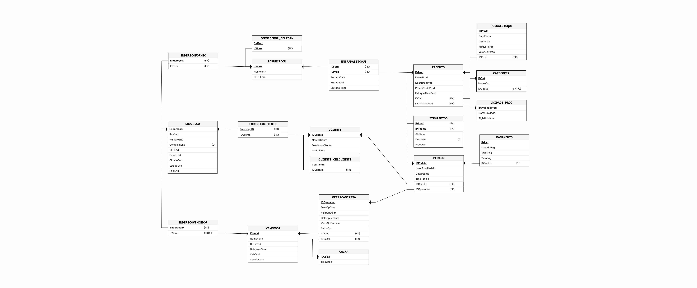

# HortifruitidaFamilia-BD

Projeto desenvolvido para a disciplina de **Banco de Dados**.

## Integrantes

- João Gabriel Carneiro Calbo
- Lucas Batista Pereira
- Samyra Mara Candido Silva

## Sobre o projeto

Este repositório implementa o banco de dados e uma aplicação CRUD para o sistema **Hortifruti da Família**.

O sistema tem como objetivo representar e gerenciar o fluxo operacional de um hortifruti, contemplando:

- cadastro de produtos, categorias e unidades de medida;
- cadastro de clientes, fornecedores, vendedores, endereços e telefones;
- entrada de estoque;
- registro de perdas de estoque;
- abertura e fechamento de operações de caixa;
- realização de vendas;
- registro de pedidos, itens de pedido e pagamentos.

O projeto foi desenvolvido com foco na modelagem relacional, criação do banco em PostgreSQL e construção de uma interface em terminal para manipulação dos dados.



## Estrutura do projeto

A organização principal do repositório é:

```text
HortifruitidaFamilia-BD/
│
├── README.md
├── modelo_logico.png
│
├── index/
│   └── index.md
│
├── sql/
│   ├── DDL.sql
│   ├── DML.sql
│   │
│   └── seeds/
│       ├── 01_categorias.sql
│       ├── 02_unidades.sql
│       ├── 03_produtos.sql
│       ├── 04_fornecedores.sql
│       ├── 05_clientes.sql
│       ├── 06_vendedores.sql
│       ├── 07_caixas.sql
│       ├── 08_estoque.sql
│       └── ...
│
└── crud/
    │
    ├── app.py
    ├── terminal.py
    ├── conexao.py
    ├── entities.py
    ├── operacoes.py
    ├── requirements.txt
    ├── estilo.tcss
    │
    ├── screens/
    │   ├── __init__.py
    │   ├── initial_screen.py
    │   ├── view_screen.py
    │   └── operation_screen.py
    │
    ├── modals/
    │   ├── __init__.py
    │   ├── view_modal.py
    │   ├── delete_modal.py
    │   ├── update_select_modal.py
    │   ├── formulario_modal.py
    │   └── formulario_pessoa_composto.py
    │
    ├── services/
    │   ├── __init__.py
    │   ├── venda_service.py
    │   ├── cadastro_service.py
    │   └── formatadores.py
    │
    └── utils/
        ├── __init__.py
        ├── filtros.py
        ├── validadores.py
        └── tabela_utils.py
```

## Organização das pastas

### Raiz do projeto

A raiz contém os arquivos gerais de documentação e representação do projeto:

- `README.md`: documentação principal do projeto;
- `modelo_logico.png`: imagem do modelo lógico do banco de dados;
- `sql/`: scripts de criação e povoamento do banco;
- `crud/`: aplicação em Python para interação com o banco.

### Pasta `index/`

A pasta `index/` contém a documentação relacionada aos índices de otimização do banco de dados.

O arquivo `index.md` apresenta uma proposta de índices para melhorar o desempenho de consultas frequentes do sistema, especialmente buscas por produtos, vendas, pedidos, pagamentos, movimentações de estoque e operações de caixa.

### Pasta `sql/`

A pasta `sql/` concentra os scripts relacionados ao banco de dados.

```text
sql/
├── DDL.sql
├── DML.sql
└── seeds/
```

O arquivo `DDL.sql` contém os comandos de criação da estrutura do banco, incluindo tabelas, chaves primárias, chaves estrangeiras, restrições de integridade e tipos de dados.

O arquivo `DML.sql` contém uma carga completa de dados iniciais para o banco.

A pasta `sql/seeds/` contém arquivos menores de inserção, separados por entidade ou etapa lógica do povoamento. Essa separação facilita os testes, a execução gradual dos inserts e a identificação de erros durante o carregamento dos dados.

### Pasta `crud/`

A pasta `crud/` contém a aplicação em Python responsável pela manipulação dos dados do banco.

```text
crud/
├── app.py
├── terminal.py
├── conexao.py
├── entities.py
├── operacoes.py
├── requirements.txt
├── estilo.tcss
├── screens/
├── modals/
├── services/
└── utils/
```

Os principais arquivos são:

- `app.py`: ponto de entrada principal da aplicação;
- `terminal.py`: versão anterior ou alternativa da aplicação em terminal;
- `conexao.py`: responsável pela conexão com o banco PostgreSQL;
- `entities.py`: mapeamento das tabelas, colunas e tipos esperados;
- `operacoes.py`: funções gerais de banco, como inserção, seleção, atualização e deleção;
- `requirements.txt`: dependências Python necessárias para executar a aplicação;
- `estilo.tcss`: arquivo de estilo da interface construída com Textual.

## Módulos da aplicação

A aplicação foi modularizada para separar melhor responsabilidades.

### `screens/`

Contém as telas principais da aplicação:

- `initial_screen.py`: tela inicial;
- `view_screen.py`: tela de visualização de dados;
- `operation_screen.py`: tela principal de operações.

### `modals/`

Contém janelas auxiliares usadas durante as operações:

- `view_modal.py`: modal de visualização com filtros;
- `delete_modal.py`: modal de deleção por ID;
- `update_select_modal.py`: modal para selecionar registros que serão atualizados;
- `formulario_modal.py`: formulário genérico de inserção e atualização;
- `formulario_pessoa_composto.py`: formulário para cadastro completo de cliente, fornecedor ou vendedor.

### `services/`

Contém regras de negócio separadas da interface:

- `venda_service.py`: lógica relacionada a vendas, carrinho, pedidos, pagamentos e baixa de estoque;
- `cadastro_service.py`: lógica relacionada a cadastros compostos;
- `formatadores.py`: funções auxiliares de formatação.

### `utils/`

Contém funções utilitárias reaproveitáveis:

- `filtros.py`: funções para filtro de dados;
- `validadores.py`: validações de entradas;
- `tabela_utils.py`: funções auxiliares para manipulação de tabelas na interface.

## Principais entidades do banco

O banco representa as seguintes entidades principais:

- `CATEGORIA`
- `UNIDADEMEDIDA`
- `PRODUTO`
- `FORNECEDOR`
- `CLIENTE`
- `VENDEDOR`
- `CAIXA`
- `OPERACAOCAIXA`
- `PEDIDO`
- `PAGAMENTO`
- `ITEMPEDIDO`
- `PERDAESTOQUE`
- `ENTRADAESTOQUE`
- `ENDERECO`
- `ENDERECOCLIENTE`
- `ENDERECOVENDEDOR`
- `ENDERECOFORNEC`
- `FORNECEDOR_CELFORN`
- `CLIENTE_CELCLIENTE`

Essas tabelas permitem representar o funcionamento do hortifruti desde o cadastro dos produtos e pessoas envolvidas até o controle de estoque e o fluxo de vendas.

## Funcionalidades da aplicação CRUD

A aplicação permite realizar operações como:

- visualizar dados das tabelas;
- filtrar registros exibidos;
- cadastrar produtos, categorias, unidades, clientes, fornecedores, vendedores, caixas e endereços;
- registrar entradas de estoque;
- registrar perdas de estoque;
- atualizar registros existentes;
- deletar registros por ID;
- abrir operação de caixa;
- montar carrinho de venda;
- finalizar pedido;
- registrar pagamento;
- fechar operação de caixa.

## Tecnologias utilizadas

- Python
- PostgreSQL
- Psycopg2
- Textual
- Rich
- Neon PostgreSQL

## Como executar o projeto

### 1. Clonar o repositório

```bash
git clone <url-do-repositorio>
cd HortifruitidaFamilia-BD
```

### 2. Criar e ativar um ambiente virtual

Dentro da pasta do projeto, crie o ambiente virtual:

```bash
python -m venv .venv
```

Ative o ambiente virtual.

No Linux/macOS:

```bash
source .venv/bin/activate
```

No Windows:

```bash
.venv\Scripts\activate
```

### 3. Instalar as dependências

Entre na pasta `crud/`:

```bash
cd crud
```

Instale as dependências:

```bash
pip install -r requirements.txt
```

### 4. Configurar a conexão com o banco

O arquivo `crud/conexao.py` é responsável por abrir a conexão com o PostgreSQL.

Para executar o projeto, é necessário configurar corretamente os dados de conexão:

- host;
- database;
- user;
- password;
- sslmode.

Por segurança, recomenda-se não versionar senhas diretamente no código. Uma alternativa melhor é usar variáveis de ambiente ou um arquivo `.env` ignorado pelo Git.

Exemplo conceitual de variáveis necessárias:

```text
PGHOST=<host-do-banco>
PGDATABASE=<nome-do-banco>
PGUSER=<usuario>
PGPASSWORD=<senha>
PGSSLMODE=require
```

### 5. Criar as tabelas do banco

A partir da raiz do projeto, execute o script DDL no PostgreSQL:

```bash
psql -d <nome-do-banco> -f sql/DDL.sql
```

Esse comando cria a estrutura do banco.

### 6. Popular o banco

Para executar a carga completa:

```bash
psql -d <nome-do-banco> -f sql/DML.sql
```

Também é possível popular o banco aos poucos usando os arquivos da pasta `sql/seeds/`. Essa forma é útil para testar e depurar inserções por partes.

Exemplo:

```bash
psql -d <nome-do-banco> -f sql/seeds/01_categorias.sql
psql -d <nome-do-banco> -f sql/seeds/02_unidades.sql
```

### 7. Executar a aplicação

Dentro da pasta `crud/`, execute:

```bash
python app.py
```

Caso esteja usando a versão alternativa em terminal:

```bash
python terminal.py
```

## Observações sobre segurança

O projeto utiliza conexão com banco PostgreSQL. Por isso, é importante evitar expor credenciais no repositório.

Recomenda-se:

- não publicar senhas no GitHub;
- usar variáveis de ambiente;
- adicionar arquivos sensíveis ao `.gitignore`;
- trocar senhas caso alguma credencial tenha sido versionada por engano.

## Observações sobre integridade

O banco utiliza chaves primárias, chaves estrangeiras e restrições `CHECK` para preservar a consistência dos dados.

Entre as restrições implementadas, destacam-se:

- preços não negativos;
- estoque não negativo;
- quantidades positivas em itens, entradas e perdas;
- documentos únicos para clientes, fornecedores e vendedores;
- relacionamentos entre produtos, categorias, pedidos, pagamentos, caixas, vendedores e clientes.

## Possíveis melhorias futuras

Algumas melhorias possíveis para versões futuras são:

- uso completo de variáveis de ambiente para conexão;
- tratamento mais amplo de erros na interface;
- validação mais rigorosa de CPF, CNPJ, CEP e datas;
- geração automática de IDs;
- criação de testes automatizados;
- melhoria da baixa de estoque no fluxo de venda;
- documentação separada para consultas e índices de otimização;
- padronização completa dos nomes de arquivos e módulos.

## Status do projeto

O projeto está em desenvolvimento acadêmico e foi construído para demonstrar modelagem relacional, criação de banco PostgreSQL e implementação de uma interface CRUD em Python.
